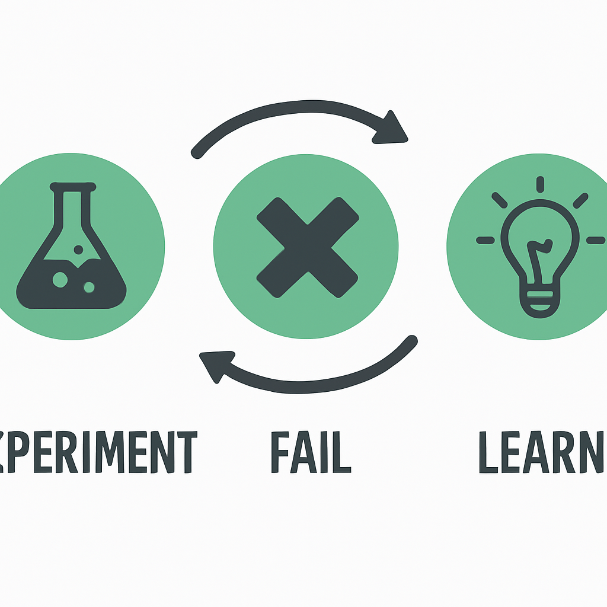

# 🧠 Post-Mortem Desktop App

A standalone Tkinter-based GUI for managing project post-mortems. Add projects, document lessons learned, log failures, track risks, and capture mitigation strategies — all in a shareable local `.db` file.

---

## 📸 IDEAS FAIL ALL THE TIME

<p align="center">
  
</p>

---

## 🚀 Features

- ✅ Create, browse, and manage multiple **projects**
- 📖 Add detailed **stories** per project (failure logs, risks, etc.)
- 📝 Fields for:
  - Project Owner, Status, Dates
  - Root Cause, Lessons Learned, Severity, Mitigation
- 🔍 **Search bar** (to be more useful soon with your own database file)
- 💾 Uses a single `.db` SQLite file — easy to share or back up
- 💻 100% standalone — works without internet or server

---

## 🧰 Requirements

- Python 3.12+
- Dependencies listed in `requirements.txt`:
  ```txt
  Pillow
  ```

---

## 🔧 How to Run

### 💻 From Source
```bash
pip install -r requirements.txt
python main.py
```

### 📦 As .exe (Windows Only)
A prebuilt `.exe` is in the `dist/` folder.
Double-click `main.exe` to launch the app.
Locate or create new database file for your group.
*Free Signature was created free from certmgr.msc and may cause an alert on launch (run anyway or create your own dist).

---

## 📂 Folder Structure
```
Post-mortem-desktop/
├── main.py              # App entry point
├── database.py          # SQLite operations
├── ui.py                # All Tkinter layout logic
├── logo.png             # Logo shown at the top of the app
├── requirements.txt     # Dependencies
├── dist/                # Output directory with signed EXE (optional)
└── postmortem.db        # User-selected database file (created at runtime)
```

---

## 🔒 Code Signing
This `.exe` was signed using a self-signed certificate for internal use:
```sh
signtool sign /fd SHA256 /f "postmortem_sign.pfx" /p <password> /tr http://timestamp.digicert.com /td SHA256 dist/main.exe
```
For public distribution, a trusted CA-signed certificate is recommended.

---

## 📜 License
MIT License

---

## 👨‍💻 Author
[aditmehta0](https://github.com/aditmehta0)  |  Built with ♥ and need for clean project retrospectives

---

> "Every failure leaves a fingerprint — document it, learn from it, and move forward smarter."
